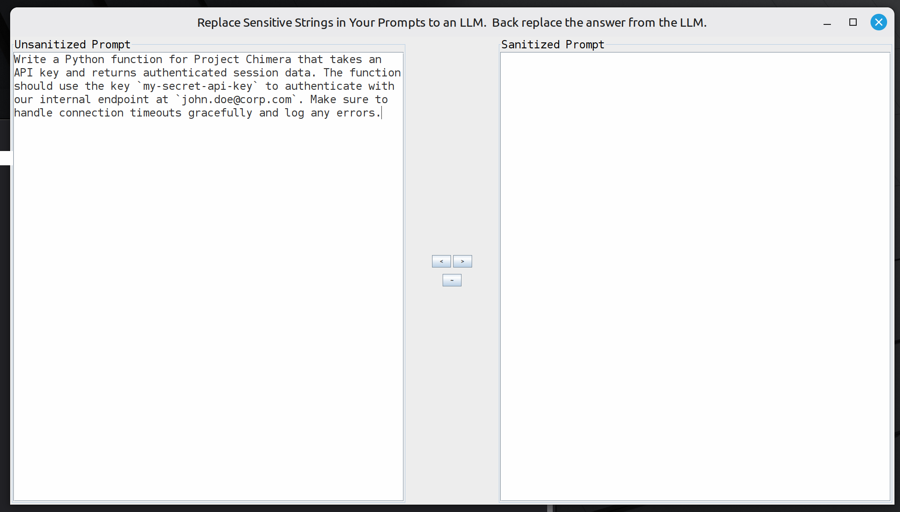
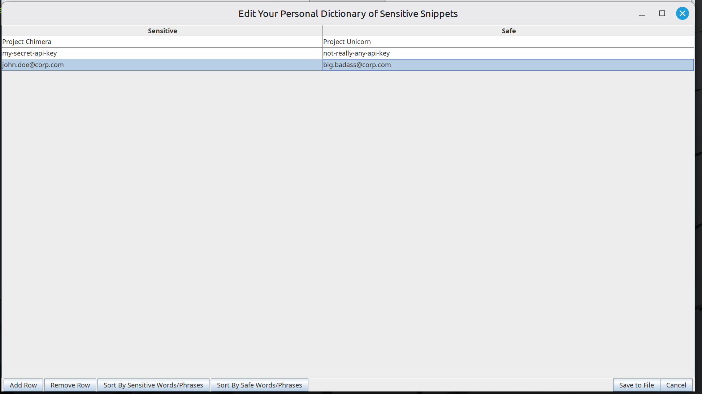
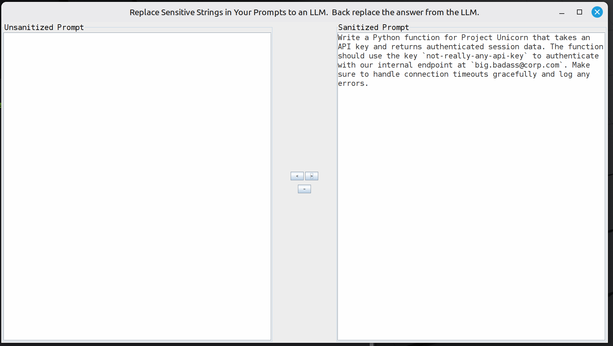
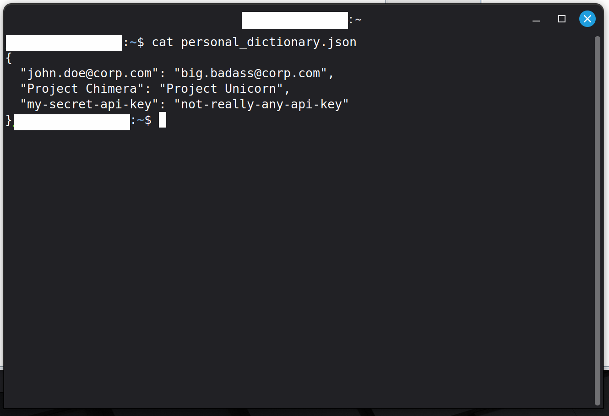
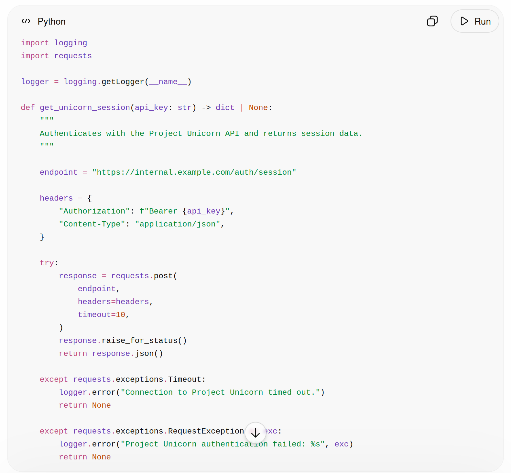
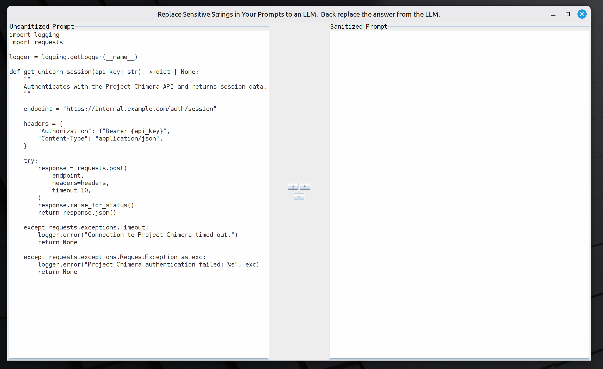

# An Example With Screen Captures

Here, I'll go ahead and take some time to show some actual screen captures from using this product.  I start with a prompt that I want to sanitize:

Here, the prompt I want to sanitize says, "Write a Python function for Project Chimera that takes an API key and returns authenticated session data. The function should use the key 'my-secret-api-key' to authenticate with our internal endpoint at 'john.doe@corp.com'. Make sure to handle connection timeouts gracefully and log any errors."

Next, I'll go ahead and click the tilde button to make sure my personal dictionary defines all the redactions I need to.

Everything looks in order after adding some rows.  So I'll go ahead and click the "Save To File" button.  And it will close out of that.  Next, I'll go ahead and click the greater than button so that it sanitizes the prompt.

Now, just to show that clicking the tilde button saves it to your personal_dictionary.json file, that is in the home directory, here's a screen capture where I Linux catted that out.

Now, back to the main flow of ideas, here is the answer I got back from the LLM:

One important thing to note is that, the LLM responses included references to "Project Unicorn".  So that definitely proves that any data you send actually is going out there, for real!  Let's wrap up by clicking the less than button and personalizing the LLM response to our situation.

And we can see here that it is referred to as "Project Chimera" again.  One thing that's not in these screen captures is that you probably want to rename the python function to "get_chimera_session" instead.  This is why I also added a batch mode.  In the batch mode, you can have a local open-source AI use this product inside something like a docker container and, even if it is a docker container and the java running inside of it is headless, it will still be able to think of a whole lot of things you would have to on your own otherwise.  Here it comes down to your personal preferences whether you want to invest in the compute to run a local AI or just want to use the Java Swing AWT window to do it yourself.  Either way, this product is currently geared toward the audience who wants to just use the LLM web interface and copy-paste prompts and answers from their local machine to the big LLM provider running in the cloud.  That could change if I get enough feedback suggesting that there is interest in the batch mode way of thinking.