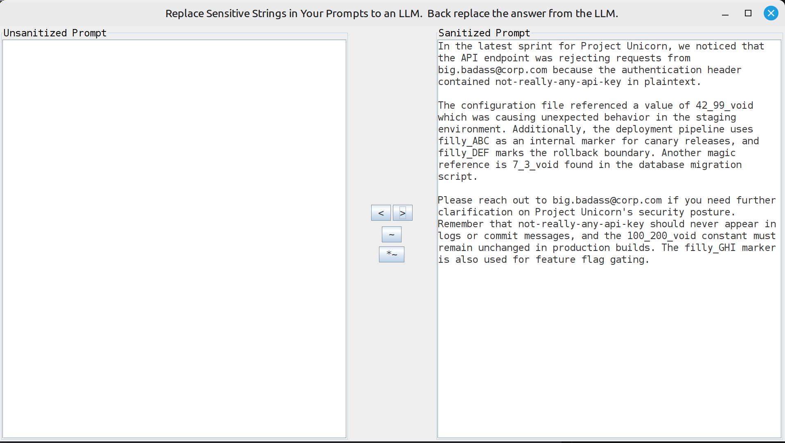

# Regex Dictionary Support - Walkthrough

The `*~` button opens the **regex dictionary editor**, where you can define pattern-based replacements using full Java regular expressions. This is the heavy artillery for sensitive data you can't enumerate one-by-one.

---

## Starting Point

Here's a sample prompt containing a mix of exact-match secrets and patterns that would be tedious to list individually:


The prompt contains:
- **Exact-match targets:** `Project Chimera`, `john.doe@corp.com`, `my-secret-api-key`
- **Pattern targets:** `42_magic_number_99`, `7_magic_number_3`, `100_magic_number_200` (magic numbers with variable digits)
- **Pattern targets:** `ABC_cliff`, `DEF_cliff`, `GHI_cliff` (canary markers with variable prefixes)

The full unsanitized text:

```
In the latest sprint for Project Chimera, we noticed that the API endpoint was rejecting requests from john.doe@corp.com because the authentication header contained my-secret-api-key in plaintext.

The configuration file referenced a value of 42_magic_number_99 which was causing unexpected behavior in the staging environment. Additionally, the deployment pipeline uses ABC_cliff as an internal marker for canary releases, and DEF_cliff marks the rollback boundary. Another magic reference is 7_magic_number_3 found in the database migration script.

Please reach out to john.doe@corp.com if you need further clarification on Project Chimera's security posture. Remember that my-secret-api-key should never appear in logs or commit messages, and the 100_magic_number_200 constant must remain unchanged in production builds. The GHI_cliff marker is also used for feature flag gating.
```


---

## The Dictionaries

### Exact-Match Dictionary (`~` button)


```json
{
  "john.doe@corp.com": "big.badass@corp.com",
  "Project Chimera": "Project Unicorn",
  "my-secret-api-key": "not-really-any-api-key"
}
```

### Regex Dictionary (`*~` button)


```json
{
  // Matches: 42_magic_number_99  ->  captures "42" and "99"
  "([0-9]*)_magic_number_([0-9]*)": {
    "repl": "$1_$2_void",        // Becomes: 42_99_void
    "dir": ">"                     // Forward direction only
  },

  // Reverse: 42_99_void -> 42_magic_number_99
  "([0-9]*)_([0-9]*)_void": {
    "repl": "$1_magic_number_$2",
    "dir": "<"                      // Reverse direction only
  },

  // Matches: ABC_cliff -> filly_ABC
  "([A-Z]+)_cliff": {
    "repl": "filly_$1",
    "dir": ">"
  },

  // Reverse: filly_ABC -> ABC_cliff
  "filly_([A-Z]+)": {
    "repl": "$1_cliff",
    "dir": "<"
  }
}
```

---

## How Direction Works

> **Key concept:** Unlike exact-match replacements (which are automatically bidirectional), regex rules require you to define *both* a forward (`>`) and reverse (`<`) rule. This gives you full control over how capture groups transform in each direction.

Because regex replacements can rearrange, drop, or repeat captured content, there's no way for the application to guess the inverse of your pattern. You define both directions explicitly:

| Direction | Symbol | When Applied |
|-----------|--------|-------------|
| Forward (sanitize) | `"dir": ">"` | Applied first, before exact-match entries |
| Reverse (restore) | `"dir": "<"` | Applied after exact-match entries (in reverse mode) |

**Replacement order in forward mode:**
1. Regex rules with `"dir": ">"`
2. Exact-match dictionary entries

**Replacement order in reverse mode:**
1. Exact-match dictionary entries (reversed)
2. Regex rules with `"dir": "<"`

---

## Forward Sanitization (Click `>`)





After clicking the `>` button, here's what changed:

```diff
- Project Chimera          ->  Project Unicorn
- john.doe@corp.com        ->  big.badass@corp.com
- my-secret-api-key        ->  not-really-any-api-key
- 42_magic_number_99       ->  42_99_void
- 7_magic_number_3         ->  7_3_void
- 100_magic_number_200     ->  100_200_void
- ABC_cliff                ->  filly_ABC
- DEF_cliff                ->  filly_DEF
- GHI_cliff                ->  filly_GHI
```

The full sanitized text:

```
In the latest sprint for Project Unicorn, we noticed that the API endpoint was rejecting requests from big.badass@corp.com because the authentication header contained not-really-any-api-key in plaintext.

The configuration file referenced a value of 42_99_void which was causing unexpected behavior in the staging environment. Additionally, the deployment pipeline uses filly_ABC as an internal marker for canary releases, and filly_DEF marks the rollback boundary. Another magic reference is 7_3_void found in the database migration script.

Please reach out to big.badass@corp.com if you need further clarification on Project Unicorn's security posture. Remember that not-really-any-api-key should never appear in logs or commit messages, and the 100_200_void constant must remain unchanged in production builds. The filly_GHI marker is also used for feature flag gating.
```

---

## Reverse Restoration (Click `<`)

The restored text is identical to the original - because every regex rule was defined as a paired forward/reverse transformation. The `([0-9]*)_magic_number_([0-9]*) -> $1_$2_void` forward rule is perfectly inverted by `([0-9]*)_([0-9]*)_void -> $1_magic_number_$2` in the reverse direction.

**Note:** Perfect round-tripping isn't guaranteed with all regex patterns. If your forward rule drops information (e.g., matching `\d+` and replacing with `[NUMBER]`), the reverse rule can't recover what was lost. You define the rules; you control the trade-off.

---

## When to Use Regex vs. Exact-Match

| Use exact-match when... | Use regex when... |
|------------------------|-------------------|
| The sensitive value is a known string | You need to match patterns (emails, phone numbers, IDs) |
| You want automatic bidirectional replacement | You need capture groups to transform the output |
| Simplicity is the priority | You're dealing with auto-generated or variable content |

In practice, most users will have far more exact-match entries than regex rules. Regex is a powerful supplement - not a replacement for the core dictionary. And if you define zero regex rules, the application works exactly as it did before this feature existed.
