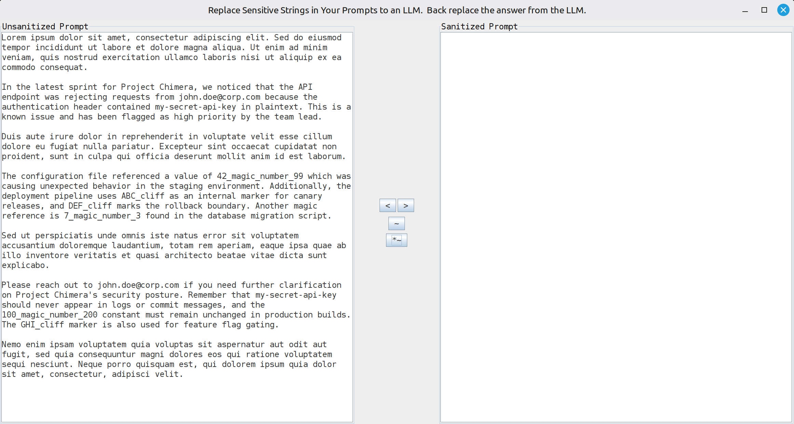
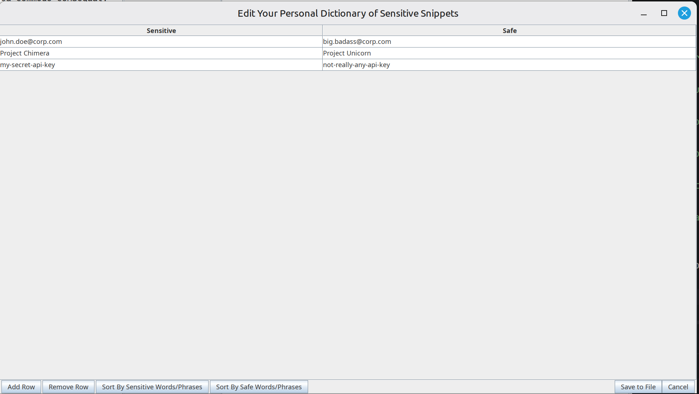
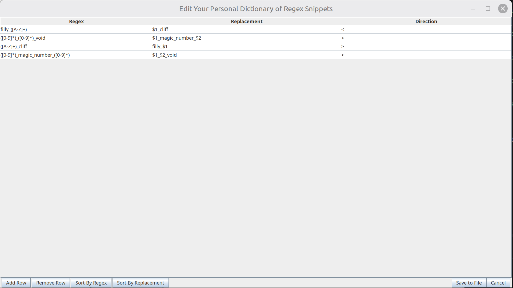

# An Example Demonstrating Regex Support

Here, I'll go ahead and focus on what happens when you have a regex personal dictionary configured via the *~ button.  We'll start with some lorem ipsum type content.



Here's the actual content:

```
Lorem ipsum dolor sit amet, consectetur adipiscing elit. Sed do eiusmod tempor incididunt ut labore et dolore magna aliqua. Ut enim ad minim veniam, quis nostrud exercitation ullamco laboris nisi ut aliquip ex ea commodo consequat.

In the latest sprint for Project Chimera, we noticed that the API endpoint was rejecting requests from john.doe@corp.com because the authentication header contained my-secret-api-key in plaintext. This is a known issue and has been flagged as high priority by the team lead.

Duis aute irure dolor in reprehenderit in voluptate velit esse cillum dolore eu fugiat nulla pariatur. Excepteur sint occaecat cupidatat non proident, sunt in culpa qui officia deserunt mollit anim id est laborum.

The configuration file referenced a value of 42_magic_number_99 which was causing unexpected behavior in the staging environment. Additionally, the deployment pipeline uses ABC_cliff as an internal marker for canary releases, and DEF_cliff marks the rollback boundary. Another magic reference is 7_magic_number_3 found in the database migration script.

Sed ut perspiciatis unde omnis iste natus error sit voluptatem accusantium doloremque laudantium, totam rem aperiam, eaque ipsa quae ab illo inventore veritatis et quasi architecto beatae vitae dicta sunt explicabo.

Please reach out to john.doe@corp.com if you need further clarification on Project Chimera's security posture. Remember that my-secret-api-key should never appear in logs or commit messages, and the 100_magic_number_200 constant must remain unchanged in production builds. The GHI_cliff marker is also used for feature flag gating.

Nemo enim ipsam voluptatem quia voluptas sit aspernatur aut odit aut fugit, sed quia consequuntur magni dolores eos qui ratione voluptatem sequi nesciunt. Neque porro quisquam est, qui dolorem ipsum quia dolor sit amet, consectetur, adipisci velit.
```

Next, let's look at both the exact text replacements, as defined by the ~ button and the regular expressions as defined by the *~ button.



which is populated by the data:
```
{
  "john.doe@corp.com": "big.badass@corp.com",
  "Project Chimera": "Project Unicorn",
  "my-secret-api-key": "not-really-any-api-key"
}
```



which is populated by the data:

```
{
  "([0-9]*)_magic_number_([0-9]*)": {
    "repl": "$1_$2_void",
    "dir": ">"
  },
  "([0-9]*)_([0-9]*)_void": {
    "repl": "$1_magic_number_$2",
    "dir": "<"
  },
  "([A-Z]+)_cliff": {
    "repl": "filly_$1",
    "dir": ">"
  },
  "filly_([A-Z]+)": {
    "repl": "$1_cliff",
    "dir": "<"
  }
}
```

Now, the thing about the regular expression personal dictionary is that, because you are taking full advantage of Java regular expressions, the syntax allows you to use wildcards.  `[0-9]*`, for example, will match any number of digits in a row.  It also allows you to define capture groups and place them in the replaced string.  So, `([0-9]*)_magic_number_([0-9]*)`, if it matches something like "123_magic_number_456", then the replacement will become "123_456_void".  Great, so, how do you perform the replacement in reverse?  Well, this is why a third parameter is needed for a direction.  So, when defining your regular expressions, unlike the exact text dictionary replacements, you have to specify a direction in which they are applied.  > is the direction of unsanitized content to sanitized and the inverse, < is the other direction.  There isn't an automatic bidirectionality defined for these because of the number of ways the replacement can define the movement or repetition of the capture groups.  The way the algorithm works in the forward direction, it applies the regular expressions that you defined as being applicable in the forward direction first and then the exact replacements.  And it goes the opposite in the reverse direction, it applies the exact replacements first and then the regular expressions you defined as being applicable in the reverse direction.  Now, let's click the > button.

And here's the exact text:

```
Lorem ipsum dolor sit amet, consectetur adipiscing elit. Sed do eiusmod tempor incididunt ut labore et dolore magna aliqua. Ut enim ad minim veniam, quis nostrud exercitation ullamco laboris nisi ut aliquip ex ea commodo consequat.

In the latest sprint for Project Unicorn, we noticed that the API endpoint was rejecting requests from big.badass@corp.com because the authentication header contained not-really-any-api-key in plaintext. This is a known issue and has been flagged as high priority by the team lead.

Duis aute irure dolor in reprehenderit in voluptate velit esse cillum dolore eu fugiat nulla pariatur. Excepteur sint occaecat cupidatat non proident, sunt in culpa qui officia deserunt mollit anim id est laborum.

The configuration file referenced a value of 42_99_void which was causing unexpected behavior in the staging environment. Additionally, the deployment pipeline uses filly_ABC as an internal marker for canary releases, and filly_DEF marks the rollback boundary. Another magic reference is 7_3_void found in the database migration script.

Sed ut perspiciatis unde omnis iste natus error sit voluptatem accusantium doloremque laudantium, totam rem aperiam, eaque ipsa quae ab illo inventore veritatis et quasi architecto beatae vitae dicta sunt explicabo.

Please reach out to big.badass@corp.com if you need further clarification on Project Unicorn's security posture. Remember that not-really-any-api-key should never appear in logs or commit messages, and the 100_200_void constant must remain unchanged in production builds. The filly_GHI marker is also used for feature flag gating.

Nemo enim ipsam voluptatem quia voluptas sit aspernatur aut odit aut fugit, sed quia consequuntur magni dolores eos qui ratione voluptatem sequi nesciunt. Neque porro quisquam est, qui dolorem ipsum quia dolor sit amet, consectetur, adipisci velit.
```

As an example of what it became, "42_magic_number_99" became "42_99_void".  "7_magic_number_3" became "7_3_void".  However, the exact text replacements happened also.  "Project Chimera" became "Project Unicorn", for example.  If this were a real prompt you were sending to a cloud AI, you would probably have your dictionaries defined differently and would be using the full weight of java regular expressions to mask confidential info if you needed to.  Let's finish up by clicking the < button.


I *could* paste it here, but it turns out to be identical to the unsanitized lorem ipsum at the beginning of this example.  That happens to be because I defined all of my regular expressions in pairs.  The `([0-9]*)_magic_number_([0-9]*) -> $1_$2_void` in the > direction just happens to be reverted by `([0-9]*)_([0-9]*)_void -> $1_magic_number_$2` in the < direction.  Your mileage may actually vary depending on how you define your regular expressions.  But, the main point, is that it is up to YOU to define the reverse rule to be what YOU consider to be a good enough approximation of inverting the forward rule.  As a practical rule of thumb, you'll probably have a lot fewer regular expression rules defined than just exact text replacements.  In fact, you don't have to have any defined and the application will work exactly as it did before this newer version incorporating regular expressions.